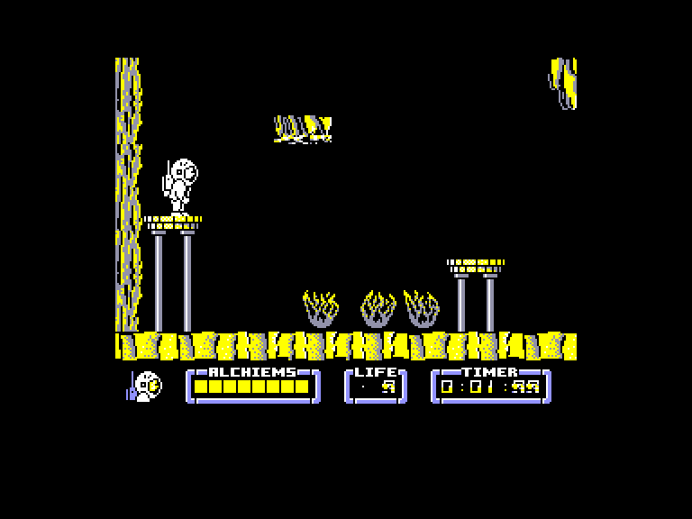

# sv2018-programming

## NodesOfYesod 

This is a (partial) remake of the 80s game Nodes of Yesod. using C# and
SDL (+Tao.Sdl).

* [0.01 - Basic Skeleton](nodes001.md)
* [0.02 - Functions](nodes002.md)
* [0.03 - Classes](nodes003.md)
* [0.04 - Enemy + player](nodes004.md)
* [0.05 - Room](nodes005.md)
* [0.06 - Collisions + movement](nodes006.md)
* [0.07 - Collisions with background + animation](nodes007.md)
* [0.08 - Gravity, jump, enemies in the level](nodes008.md)
* [0.09 - Several connected rooms](nodes009.md)
* [0.10 - Help screen](nodes010.md)
* [0.11 - Three lives](nodes011.md)
* [0.12 - Different enemies](nodes012.md)
* [0.13 - Scroll](nodes013.md)
